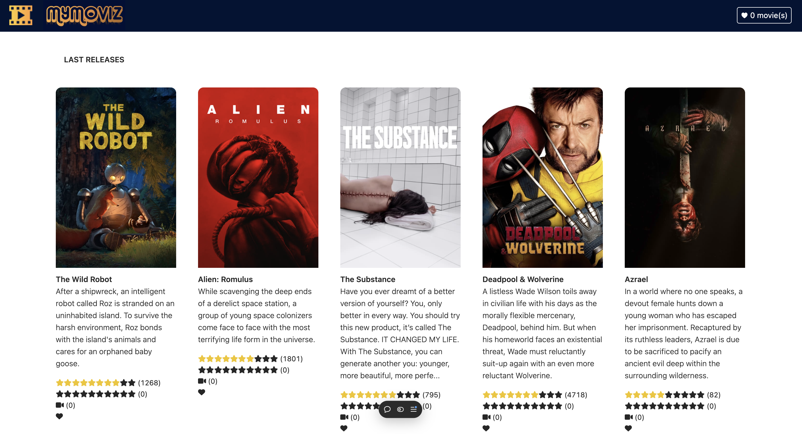

# My Moviz

**My Moviz** is a full-stack web app that displays the latest movie releases. Users can add movies to their favorites, manage a view counter, and rate each presented film.

## Features

- **Movie Listings**: View the latest movie releases.
- **Favorites**: Add and remove movies from your favorites list.
- **View Counter**: Keep track of movies you've watched.
- **Rating System**: Rate movies using a star-based system.
- **Dynamic Content**: Movie information fetched from The Movie Database API.
- **Responsive Design**: Styled with React components.

## Tech Stack

**Frontend**: React, Next.js, Tailwind CSS  
**Backend**: Node.js, Express
**API**: The Movie Database (TMDB)  
**Deployment**: Vercel

## Repositories

- **Frontend**: [lacapsule-mymoviz-frontend](https://github.com/vinesk/lacapsule-mymoviz-frontend)
- **Backend**: [lacapsule-mymoviz-backend](https://github.com/vinesk/lacapsule-mymoviz-backend)

## Setup

### Frontend

1. Clone the frontend repo:

   ```bash
   git clone https://github.com/vinesk/lacapsule-mymoviz-frontend.git
   cd lacapsule-mymoviz-frontend
   ```

2. Install frontend dependencies:

   ```bash
   npm install
   ```

3. Create a `.env.local` file with the following:

   ```bash
   NEXT_PUBLIC_BACKEND_URL=https://your-backend-url
   ```

4. Start the frontend:

   ```bash
   npm run dev
   ```

### Backend

1. Clone the backend repo:

   ```bash
   git clone https://github.com/vinesk/lacapsule-mymoviz-backend.git
   cd lacapsule-mymoviz-backend
   ```

2. Install backend dependencies:

   ```bash
   npm install
   ```

3. Create a `.env` file with the following:

   ```bash
   TMDB_API_KEY=your-tmdb-api-key
   FRONTEND_URL=https://your-frontend-url
   ```

4. Start the backend:

   ```bash
   npm run start
   ```

## Usage

- **Browse Movies**: View the latest movie releases.
- **Favorite**: Add movies to your favorites list.
- **Rate**: Give movies a star rating.
- **Track Views**: Mark movies as watched.

## License

MIT License. See the [LICENSE](./LICENSE) file for details.
